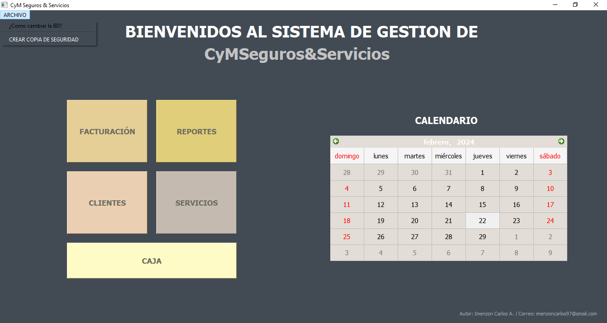
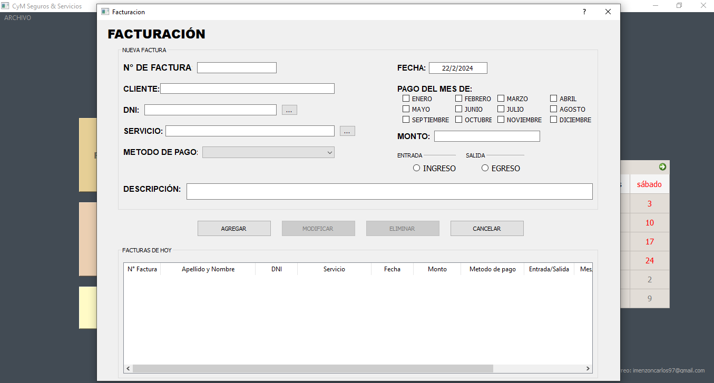
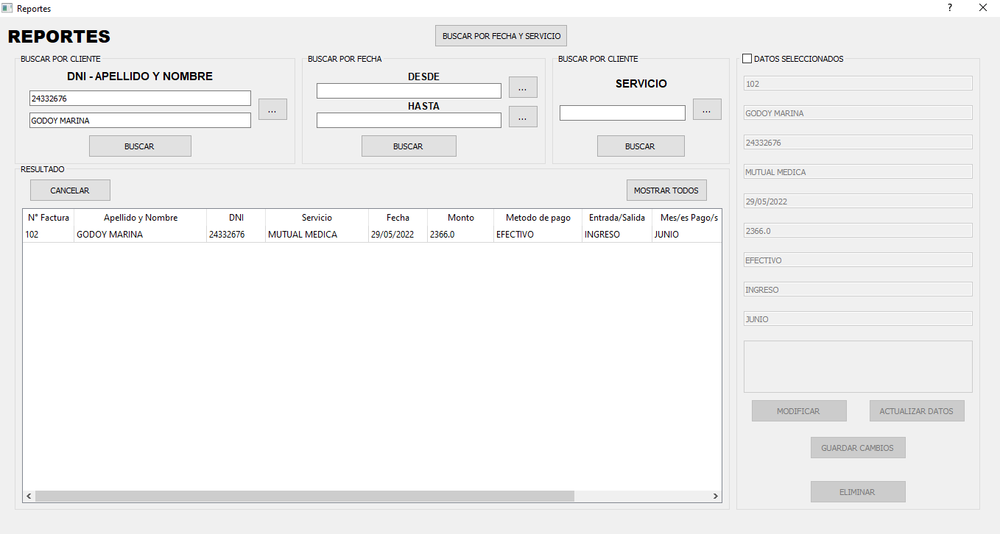
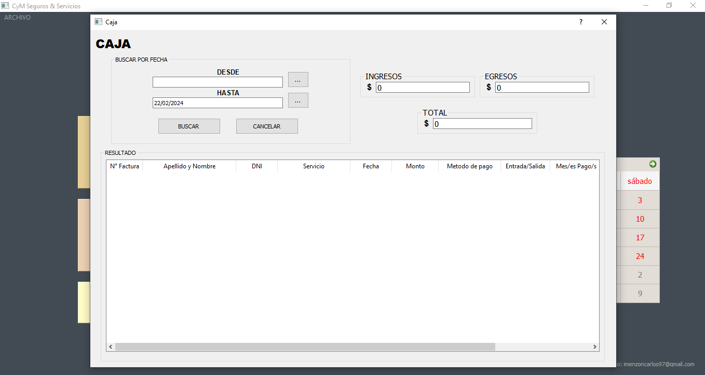
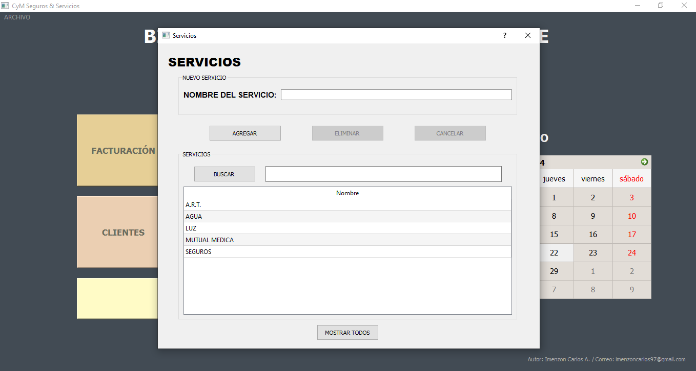

# App Oficina CRUD

**Realizado por:** _Carlos A. Imenzon_,
**Email:** _imenzoncarlos97@gmail.com_.

Realizado 100% con el lenguaje **_Python_** con base de datos **_SQLite_**, 
la creacion de la interfaz grafica fue con **_PyQt5_**.  
Aplicacion contable de gestion de usuarios para la empresa "CyMSegurosyServicios"
de Adelia Maria.

## Imagenes del proyecto

